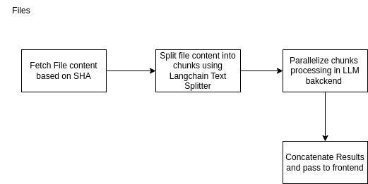
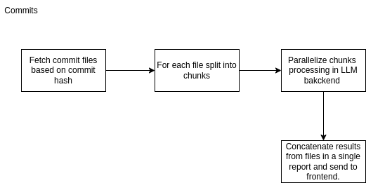

# Tasks:

## Backend:

I did the following tasks in the order of priority.

1. Setting up backend project.

# File

2. Figuring out how to get file with sha from a github repo.
3. Divided data into chunks before sending to langchain
4. Use langchain to pass the file content to a prompt in langchain.
5. Get quality score and the reasoning from the model (currenlty will use gpt 4)
6. Gives quality report of a single file with reasoning.

# Commit

2. Getting files from commits
3. passing files in chunks to the backend for processing.
4. Parallelize processing of chunks and files for fater retrieval
5. Combile individual reports in one.
6. It gives the quality report of individual files in a single commit separately with reasoning.

7. Containerize the environment for code.

## Architecture diagrams

# File

Below diagram shows the workflow for fetching quality score for file.


# Commit

Below diagram shows workflow for fetching quality score for commit


# Note (Improvements for commits (Future tasks))

The commit api call takes a lot of time for processing due to large number of files.
An improvement is to use streams for llm batch processing but it takes a bit of time to implement.
I would love to discuss this approach.

## Frontend:

1. Setting up next js with typescript
2. Setting up tailwind css and an initial form for submitting sha and github link. (as bonus)
3. Used sha cdn for quickly spinning up the components and setting up the containers.

## Improvements (Future Tasks):

1. I haven't used any database, however in the future a database could be used for
   a. Authentication setup
2. Add functionality to search from web to get latest coding quality standards and practices as well.
3. Setting up login/signup
4. Saving history of the chat using langchain persistance layer and connect our database with it. (Looking into this currently)
5. For the commit api call (since it takes a bit of time). Add functionality to stream LLM response as done in LLM. Langchain provides functions to stream response which I'm looking into now for later on.

## API Endpoints

1. /code-quality
   (create a code quality snippet for a result)

# How to run locally:

## a. Using node and npm. (Recommended)

# Install node and npm (Node v20)

Below are the versions I tested it on.

```
jawad@jawad-HP-EliteBook-840-G5:~/Desktop/strive-assignment$ node -v
v20.11.1
jawad@jawad-HP-EliteBook-840-G5:~/Desktop/strive-assignment$ npm -v
10.2.4
```

# Backend folder

1. Make a `.env` file in the backend folder root and copy contents from `.env.backend` provided by me.
2. go to backend folder and run following commands

```
npm install
npm start
```

## Frontend Folder

1. Make a `.env.local` file in the backend folder root and copy contents from .env.backend provided by me.
2. Go to frontent folder and run the following commands

```
npm install
npm run dev
```

This will open the application on http://localhost:3000. Navigate there and try out the app.
I'll provide the env files for backend and frontend.

## b. Using docker

1. Setup

1. Make a `.env.local` file in the backend folder root and copy contents from .env.backend provided by me.

1. Make a `.env.local` file in the backend folder root and copy contents from .env.backend provided by me.

1. Install docker from https://docs.docker.com/engine/install/ubuntu/
1. Navaigate to the root of the project having `docker-compose.yaml` file and run

```
docker-compose up --build
```

The application will run on port 80 of http://localhost

# Important Note:

Added some gateway timeout increase to process request in case of a commit

# Deployment:

I've dockerized the environment and currently don't have any free ec2 instance for deploying it.
For the deployment I was thinking of using aws ec2 and serving the application from port 80 as I'm doing here and use AWS ASG for scaling the application based on user demand. I have experience in that and that's why I dockerized the environment to showcase my expertise.

Kubernetes could also be looked into by making multiple pods of the application in a cluster. For that
there will be a need to write kubernetes manifests. These things will take a bit of time. Hence, I mentioned them in furture improvements since my main priority is to make a demo initially.

# Testing:

This is another aspect that would be looked into at this point. Setting up a testing environment for the backend and the frontend. For the backend, we can check edge case as follows:

## Backend:

1. When an invalid sha commit is provided.
2. Invalid file type is provided.
3. Invaild repo url is given.

We will use `mocha` and `chai` freamework for this.

## Frontend:

1. Check rendering of input fields.
2. Check rendering of form is correct.

We will use `jest` framework for this.

## Validation

I've setup validations for the commit and file based endpoints to check if the url and the commits are valid in case of a `file` or a `commit` type..
This is to avoid passing data to LLM in case we have invalid data and save api calls.
Validations can be found in the `middleware` folder inside the backend code.
